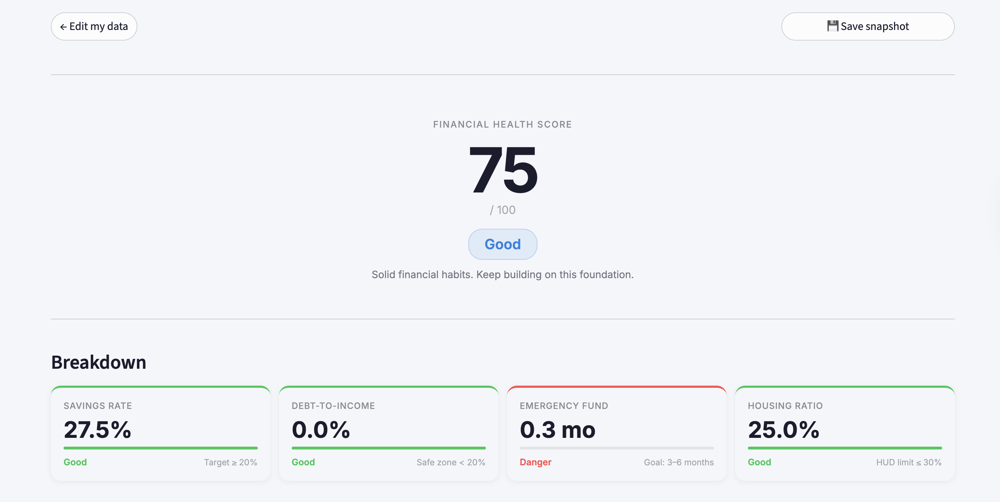
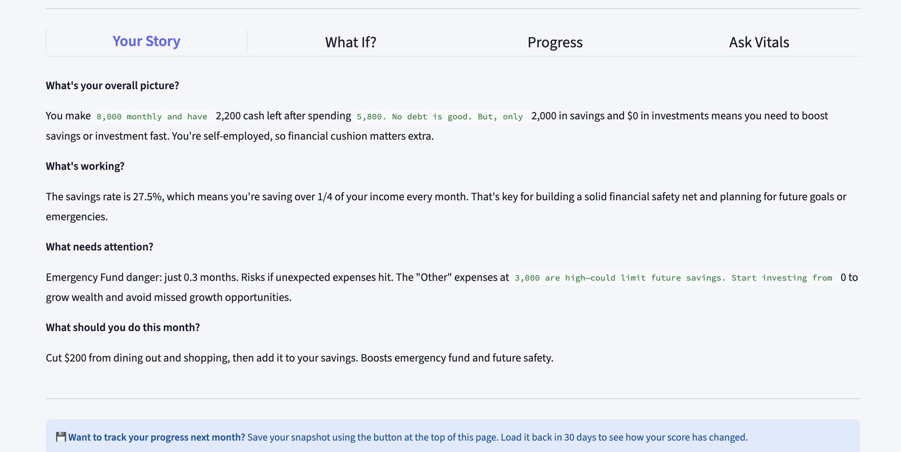

# Vitals

A 5-minute monthly financial health checkup. No bank connection. No account. Just your numbers and an honest score.

**Live app:** https://myfinance-vitals.streamlit.app/

---

## What it does

Enter your rough monthly income and expenses. Vitals scores your financial health across four metrics — savings rate, debt-to-income, emergency fund, and housing cost — each benchmarked against published standards (CFPB, HUD, Fidelity). An AI then narrates your situation in plain English: what's working, what needs attention, and one concrete action for this month. Save a snapshot to track your progress over time.

---

## Screenshots

**Health score + metric breakdown**


**AI narrative + expense chart**


---

## How the score works

| Metric | Benchmark | Source |
|--------|-----------|--------|
| Savings rate | ≥ 20% of take-home income | 50/30/20 rule |
| Debt-to-income | ≤ 43% of take-home income | CFPB qualified mortgage threshold |
| Emergency fund | 3–6 months of expenses | Fidelity / Vanguard |
| Housing ratio | ≤ 30% of take-home income | HUD affordability standard |

DTI uses take-home income (not gross) — your payments come out of what actually hits your account, so this gives a stricter and more honest picture than a lender's calculation.

---

## Running locally

**Prerequisites:** Python 3.9+

```bash
pip install -r requirements.txt
cd app
streamlit run main.py
```

Create `.streamlit/secrets.toml`:

```toml
SUPABASE_URL      = "https://your-project.supabase.co"
SUPABASE_KEY      = "your-anon-key"
HOSTED_API_KEY    = "your-llm-api-key"
HOSTED_PROVIDER   = "groq"           # groq | anthropic | openai | gemini
SHOW_API_INPUT    = false            # false = use hosted key, true = user brings their own
ENABLE_LOGGING    = false            # false = skip Supabase writes (use locally to avoid fake data)
DEBUG             = false
```

No API key needed on the live app — it runs on a hosted key by default.

---

## Snapshot format

Data is saved as an encrypted `.vit` file — one file holds all months. Same-month saves overwrite. Fernet encryption (AES-128-CBC + HMAC) prevents accidental exposure if the file ends up on a shared computer or cloud sync folder.

Inspect a snapshot from the command line:

```bash
python tests/decrypt_finfd.py path/to/my_vitals.vit
python tests/decrypt_finfd.py path/to/my_vitals.vit --full
```

Generate a 6-month fake snapshot for testing the Progress Charts tab:

```bash
python tests/generate_fake_data.py
```

---

## Project structure

```
vitals/
├── app/
│   ├── main.py                  # Page config, CSS injection, session state init, routing
│   ├── pages/
│   │   ├── get_api_key.py       # Step-by-step API key guide (all 4 providers)
│   │   └── feedback.py          # Feedback form → Supabase
│   └── modules/
│       ├── panel_form.py        # Progressive form UI (income, expenses, position, context)
│       ├── panel_results.py     # Score, 4-tile breakdown, chart, 4 result tabs
│       ├── health.py            # Scoring logic + get_financial_context()
│       ├── narrative.py         # AI narrative — 4 Q&A stream (all 4 providers)
│       ├── chat.py              # Vitals Chat — classifier, category prompts, summarisation
│       ├── snapshot.py          # Form section render functions
│       ├── storage.py           # Fernet encryption, .vit read/write
│       ├── simulator.py         # What-If Simulator — sliders + live score recalculation
│       ├── progress.py          # Progress Charts — merge history + current session
│       ├── analytics.py         # Session-level funnel tracking → Supabase
│       ├── education.py         # Contextual education content (why metrics matter)
│       └── feedback_db.py       # Supabase client + submit_feedback()
├── .streamlit/
│   ├── config.toml              # Theme + server settings
│   └── custom.css               # All custom styles — fonts, buttons, tabs, animations
├── tests/
│   ├── decrypt_finfd.py         # CLI: decrypt + inspect .vit files
│   ├── generate_fake_data.py    # Generate 6-month fake .vit for testing
│   └── test_classifier.py       # Chat classifier unit tests
├── assets/                      # Screenshots + logo
├── DECISIONS.md                 # Product thinking and design rationale
└── requirements.txt
```

---

## Tech stack

Python · Streamlit · Plotly · Cryptography (Fernet) · Supabase · Anthropic / OpenAI / Groq / Gemini

---

## Contributing

Design decisions — why no bank connection, how scoring works, how Vitals Chat handles guardrails — are in [DECISIONS.md](./DECISIONS.md).

MIT License · Built by Pavan Hebli
